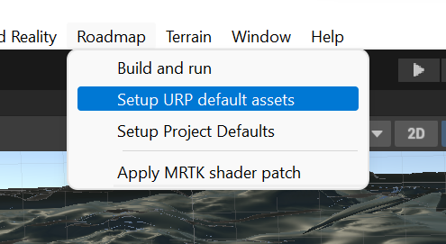
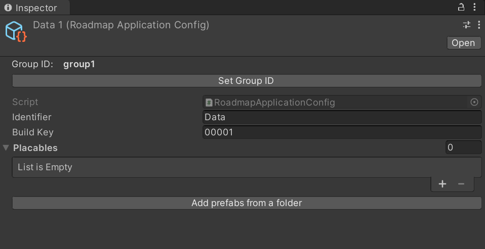
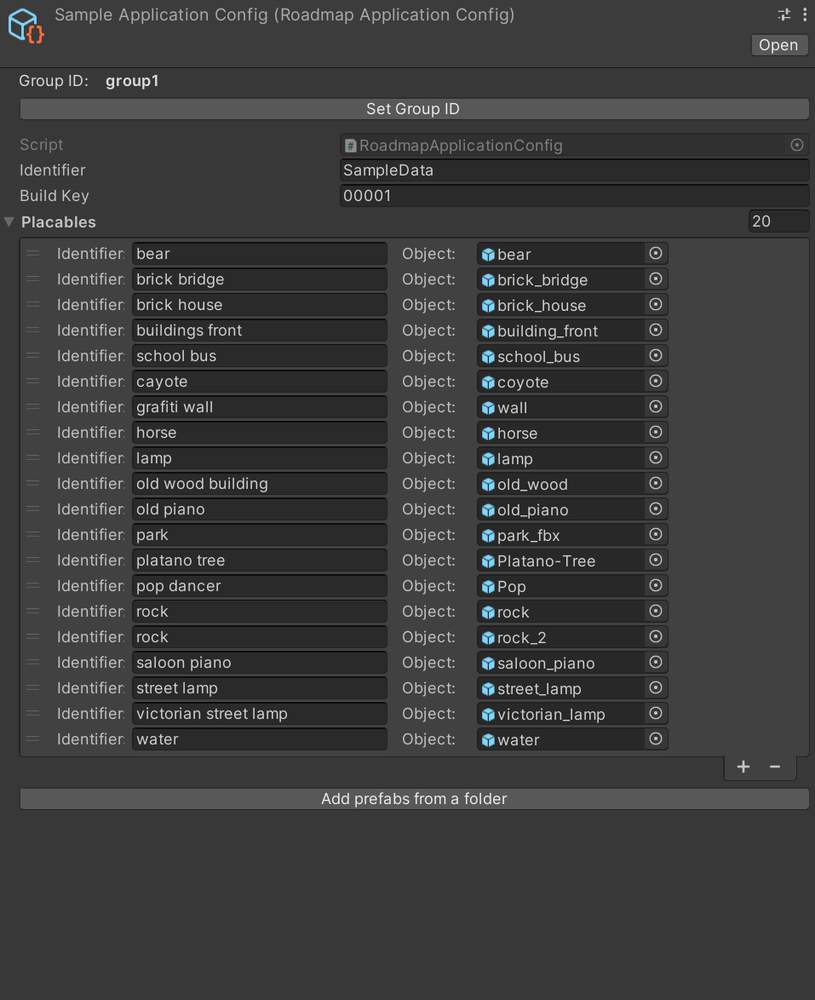
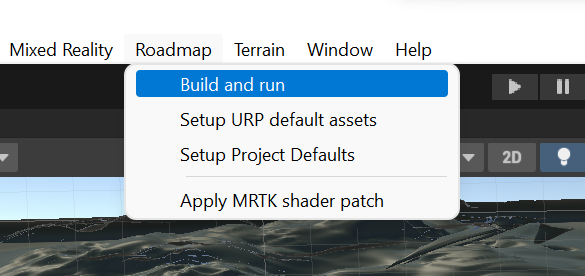

# Roadmap

This is a unity package that delivers the authoring application for the UBCO roadmap. It has two components, a VR application and an AR application. Functionally they are the same, they allow to place, manipulate and persist models in the environment. 

- **AR Application**: The AR application is built for mobile AR (Android/iOS). It uses the google's geospacial API, which uses the google streetview to localize and persist model locations between sessions with much better accuracy. See more information in the API: https://developers.google.com/ar/develop/geospatial

- **VR Application**: This is an Oculus application that allows the users to build out the environments in the VR when they are iterating on the designs. The current version mimcs the environment along the pathway north of the UBCO Campus.

## Installaition
Note that the guides are written primarily for android, but they apply to iOS builds as well
### Install prerequisites
- To ease things, make sure the project is switched to android platform (in build settings), the color space is switched to `linear` (in `project settings` > `player`).
- Install and configure [Oculus Integration for unity](https://developer.oculus.com/documentation/unity/unity-gs-overview/).
- Install and configure [MRTK](https://learn.microsoft.com/en-us/windows/mixed-reality/mrtk-unity/mrtk2/?view=mrtkunity-2022-05) for [Oculus](https://learn.microsoft.com/en-us/windows/mixed-reality/mrtk-unity/mrtk2/supported-devices/oculus-quest-mrtk?view=mrtkunity-2022-05) and [Mobile AR](https://learn.microsoft.com/en-us/windows/mixed-reality/mrtk-unity/mrtk2/supported-devices/using-ar-foundation?view=mrtkunity-2022-05)
- Install [AR Core extensions](https://github.com/google-ar/arcore-unity-extensions.git) (See below for image guides)
  - In the pacakge manager, select "Add Package from git URL" from the dropdown on the topleft corner (the `+` sign).
  - Enter the url `https://github.com/google-ar/arcore-unity-extensions.git`
- Ensure the ARCore, ARKit and Oculus XR plugins are installed.
  - In the `project settings`, select and `XR plug-in management`.
  - Install if it's not already installed.
  - Under the android tab, select `ARCore` and `Oculus`
  - Under iOS tab, select `ARKit`
### Install and setup roadmap
- Install package from git:
  - In the pacakge manager, select "Add Package from git URL" from the dropdown on the topleft corner (the `+` sign).

  - Enter the url `https://github.com/hcilab-uofm/Roadmap-core.git`

  - The link can be found in on github:

- Once it finishes installing, setup URP. Optionally, you may use the profiles shipped with this package. In the project windows it can be found in `Pacakges` > `roadmap-core` > `Assets` > `Essentials` > `Settings`
  - Update project with default URP settings: `Roadmap` > `Setup URP default assets`

  - Update the MRTK shaders: `Mixed Reality` > `Toolkit` > `Utilities` > `Upgrade MRTK Standard Shaders for Universal Render Pipeline`
- Follow instructions in [this issue comment](https://github.com/microsoft/MixedRealityToolkit-Unity/issues/10449#issuecomment-1295233907) if you get the following error when building:
```sh
Shader error in 'Mixed Reality Toolkit/Standard'
```


## Usage

### Main configuration
The main workhorse of this project is the `RoadmapApplicationConfig` object. A sample is provided with the project:


The models (as prefabs) and relevant data that you will use in the deployed apps on both AR and VR are configured using this. You can create your own config asset in the project window:


Give an appropriate name and setup the configuration. Configuration can be done in the inspector when you select the config asset in the project window. 


The inspector would look something similar to this if you don't have any errors/issues and have a few models setup:


If you have any errors/issues you'll see appropriate options and messages to help you resolve them. 

To use the configuration in the builds, you can add them to the `PlaceablesManager` component in the `PlatformManager` prefab in the scene.


To see how the respective AR (mobile) and VR (oculus quest) scenes would be configured, please see the AR and VR scenes available with the pacakge (see below). The necessary prefabs are also available in the package. Instead of configuring your own scenes, you can duplicate them into the project to add new functionalies. 


### Adding models
You can add/remove models through the inspector of a corresponding config (see above images) under `Placeables` using the `+` and `-` buttons. Each entry in `Placeables` should have a unique name and the corresponding prefab object. If there are duplicate entries (same identifier used or same prefab used), you will get a warning message and the option to remove duplicates along with the option to fix them.

From the inspector you can also builk add prefabs. Clicking on `Add prefabs from a folder`, will open a new window where you can select a folder. It would recursively search the folder and get all prefabs and list them. To add all the items displayed click on `ok`, or `cancel` otherwise.


### Building and deploying apps
You can easily switch platforms, build and deploy applications for both AR and VR from the `Roadmap Build Setup` window. It's available on the menu:


In the window, you will have to drag and drop the respective scenes that should be built and deployed in the `AR` and `VR` fields. The location, relative to the project folder, can be set here. Select the platform you would want to build/deploy. If you are the `oculus` is selected as the target platform and `start build` is clicked, the `OVR Build APK` window will be opened for you where you can build deploy for oculus. If `arcore` is selected, the `start build` button will directly build the app. The `deploy` buttons works the same for both platforms, where it will be installed using adb to the device.

Note that, irrespective of which scene is currently open, if configured correctly, the correct scene would get built.


### Updating package
This project is actively being develop. To update the package, from the package manager, you can click on `update`. If you you see unexpected errors, try removing and adding the pacakge back again. If you find any other problems with the package, don't hesitate to create a new issue on github.


To see the changes made, you may look at the [CHANGELOG.md](CHANGELOG.md) file.

## Acknowledgement
- The AR version of the projects is built from the amazing PocketGarden implementation: https://github.com/buck-co/PocketGarden
